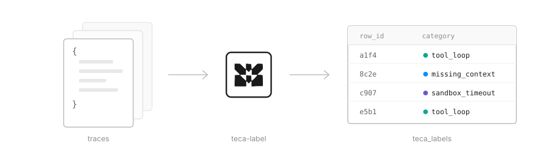

<h1 align="center">teca-label</h1>
<p align="center">Stable semantic events for your agent's traces</p>

<p align="center"></p>

An agent product generates a few thousand traces and someone needs to know what people are actually using it for. Marketing wants to know what to say about it, leadership wants to know if it deserves more investment, finance wants to know how usage differs by plan, and product wants to know whether a new feature changed what people do.

The obvious move is to pull the traces into a coding agent and ask it to categorize them. That works once. The numbers are point in time, so nobody trusts them a week later. They live in a script one person can run, so the understanding leaves when that person does. And they don't join to anything, so nobody can ask whether a use case is growing on the pro plan or which use cases get exported. The numbers need to work in the warehouse like every other metric.

Teca Label is the version of that analysis you can keep. You ask one question over a sample of traces, it drafts a fixed set of categories, you edit them, and it labels every row into a table in your own Postgres. The categories are a file in git. They change only through a diff you approve, and the model that applies them is measured before you switch it. What you get is a column you can JOIN to plans, tools, and outcomes that means the same thing next month as it does today.

## What you'd use it for

- **What jobs do people bring to the agent?** As shares of sessions, not a handful of examples
- **Which kinds of asks stall before the outcome?** A category JOINed to your export or conversion column
- **Where does the user overrule the agent?** The tool ran fine, the user said "no, redo it"
- **Is a segment growing?** The same categories week over week, so a change in share is a change in the data
- **Did the fix work?** Before and after on the same definitions, so the comparison holds
- **What are people asking for that the agent doesn't do?** The rows that fit no category, read regularly

Every one of these is a category read from the traces, JOINed to a column you
already log. The library gives you the column; the question is answered in SQL.

## Is Teca Label for you?

You're a good fit for Teca Label if you:
1. ship an agent product with real traffic and keep its traces in Postgres
2. treat the warehouse as the source of truth and answer questions with SQL
3. have written a one-off classification script, been asked for the number again a month later, and watched it not match
4. want to read a change to your categories as a diff, the way you'd read a schema migration
5. would rather bring your own API key than add another tool that holds your data

You're not a good fit for Teca Label if you:
1. have little traffic yet; a codebook needs enough rows to draft from and to notice drift in
2. already have classifiers over your traces you're happy with
3. want dashboards or a UI. There are none; your warehouse and BI tools are the interface

## Why not just ask Claude Code?

You can, and for a one-off question you should. A coding agent will also happily write you a frozen classifier: a prompt, an enum, a loop over the table. That part is easy. What it doesn't give you is everything that happens after the first run, and that is what you end up maintaining yourself:

- **Revisions.** The categories will need to change. A change has to be a diff someone reads, applied all at once, with the version bumped, so that no label silently changes meaning.
- **Historical labels.** Every label written last month has to stay readable under the definitions that wrote it. After a change that moves a boundary, old rows have to be relabeled too, or old rows keep the old label while new rows get the new one and the chart shows a trend that isn't there.
- **Interrupted runs.** A run that dies halfway must leave nothing half-written, resume where it stopped, and never label a row twice.
- **Review.** When new rows stop fitting, someone has to notice, draft the change with evidence, and put it in front of a person before it takes effect.
- **The model.** Fixed definitions don't fix the labels. A model update, yours or the vendor's, shifts them with no change to a definition. The model has to be recorded on every label and measured against a small human-labeled benchmark before it's switched.

Teca Label is that machinery, tested, with a file format and a table shape you can read in an afternoon. The classifier is the small part.

## How does it work

- Sample rows from your Postgres table and ask one question over them
- Get back a codebook: a short list of named, defined categories, with the sample labeled so you can check it
- Edit it, or accept it
- Label your full table, or just new rows going forward, into `teca_labels`
- Put it on a schedule; when new rows stop fitting, it proposes a diff and waits for you

## What do you get from it

- a stable category on every trace, as a column in your own database
- labels that JOIN to your outcome columns on the record id, so the analysis is a query you already know how to write
- every change to the categories versioned and tracked by a diff you approve
- every change to the model measured against a human-labeled benchmark and recorded with the measurement
- a run ledger (`teca_runs`) recording each scheduled run, with every label the runner writes carrying the id of the run that wrote it

## What it doesn't do

- It doesn't know what success means for your product. Outcomes are columns you already log; the label joins to them.
- It doesn't build dashboards or store your data. Labels land in your Postgres; codebooks are files in your git.
- It doesn't replace tracing or observability. It reads whatever traces you have and writes one column next to them.
- It isn't free. Every draft and every label is a model call; `plan()` prints the estimate before anything is spent.

## Quickstart

```
pip install 'teca-label[postgres] @ git+https://github.com/areznik23/teca-label'
export ANTHROPIC_API_KEY=...
```

Python 3.10+. `dsn` is your Postgres connection string (`postgres://...`). OpenAI models work too: `pip install 'teca-label[openai] @ git+https://github.com/areznik23/teca-label'`, set `OPENAI_API_KEY`, and pass `models={"draft": "gpt-...", "classify": "gpt-...", "extract": "gpt-..."}` to `plan()` (`extract` only runs when you split long records into excerpts).

```python
from teca_label import Codebook
from teca_label.sources import fetch, label_postgres

traces = fetch(dsn, "SELECT id, body FROM sessions WHERE NOT completed ORDER BY created_at",
               to_trace=lambda body: {"text": body}, sample=60)   # only the rows the question is about

plan = Codebook.plan(traces, question="Why do my agent's sessions fail?",
                     path="failure-modes.codebook.json",
                     rows=48_000)          # rows you'll label in total, for the cost line
print(plan)                                # rows, fields, sample, models, dollars; no call yet
cb = plan.build()

print(cb.show())                           # the categories with shares from the sample

label_postgres(cb, dsn, "SELECT id, body FROM sessions WHERE NOT completed",
               to_trace=lambda body: {"text": body})   # every unlabeled row -> teca_labels
```

Labeling is idempotent: rerun it and only rows no version has judged are labeled. After you
apply a revision, pass `on_version_change="relabel_touched"` (what the scheduled runner does)
to re-judge the rows the change could have moved, or `"relabel"` for everything.

The two cuts every agent team ends up wanting are built in: `teca_label.ingest`
turns a provider message array into rows for them directly:

```python
from teca_label.ingest import tool_firings, revision_loops

rows  = tool_firings(messages, "search_docs", session_id=sid, ts=ts)   # what was the user asking when this tool fired?
loops = revision_loops(messages, session_id=sid, ts=ts)                  # what did the user say that made the agent redo it?
```

Scheduling and drift review: [docs/project.md](docs/project.md). The codebook file and the labels table, field by field: [FORMAT.md](FORMAT.md).
